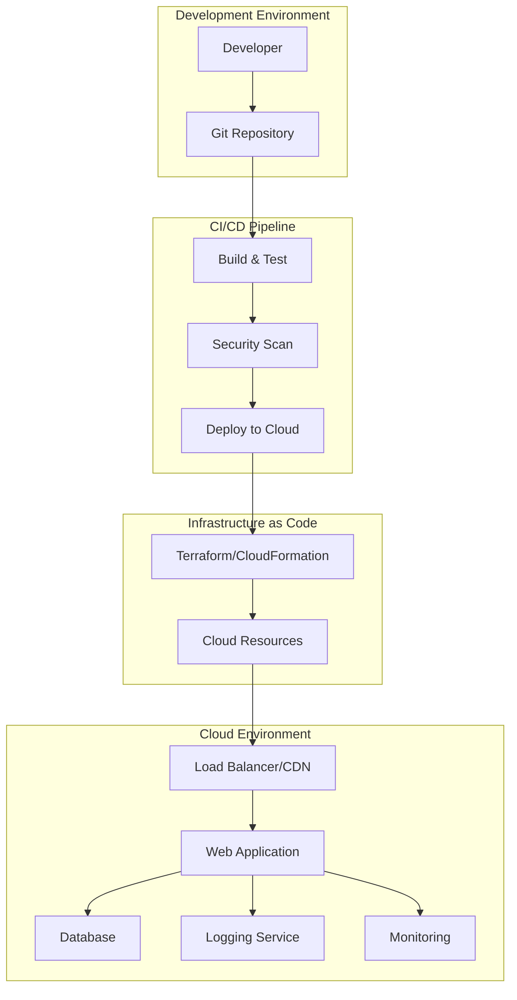

# Design Document

## Overview

The Interactive To-Do List Application is designed as a demonstration platform for modern DevOps practices and CI/CD pipeline implementation. The system architecture prioritizes simplicity in application functionality while showcasing comprehensive deployment automation, security, testing, monitoring, and infrastructure management.

The design follows cloud-native principles with Infrastructure as Code (IaC), automated testing at multiple levels, comprehensive logging and monitoring, and security best practices integrated throughout the deployment pipeline.

## Architecture

### High-Level Architecture



### Technology Stack Options

#### Option 1: Full DevOps Stack (Recommended)
- **Frontend**: React.js with TypeScript for type safety
- **Backend**: Node.js with Express.js API
- **Database**: PostgreSQL (AWS RDS) or MongoDB (Atlas)
- **Infrastructure**: Terraform for IaC
- **CI/CD**: GitHub Actions or GitLab CI
- **Cloud Provider**: AWS (EC2, RDS, S3, CloudWatch)
- **Monitoring**: CloudWatch + custom dashboards
- **Security**: AWS Security Groups, SSL/TLS, dependency scanning

#### Option 2: AWS Learner Lab Simplified
- **Application**: Single-page React app with local storage
- **Infrastructure**: AWS CloudFormation templates
- **Hosting**: S3 static hosting + CloudFront
- **Database**: DynamoDB for simplicity
- **Monitoring**: CloudWatch basic metrics
- **CI/CD**: Manual deployment with automation scripts

## Components and Interfaces

### 1. Web Application Component

**Frontend Interface:**
- Single-page application with responsive design
- Task management interface (add, edit, delete, toggle completion)
- Real-time status updates and error handling
- Progressive Web App (PWA) capabilities for offline functionality

**Backend API Interface:**
```typescript
interface TodoAPI {
  // Task operations
  GET /api/tasks - Retrieve all tasks
  POST /api/tasks - Create new task
  PUT /api/tasks/:id - Update existing task
  DELETE /api/tasks/:id - Delete task
  
  // Health and monitoring
  GET /health - Application health check
  GET /metrics - Application metrics for monitoring
}
```

### 2. Infrastructure as Code Component

**Terraform Configuration Structure:**
```
infrastructure/
├── main.tf              # Main configuration
├── variables.tf         # Input variables
├── outputs.tf          # Output values
├── modules/
│   ├── networking/     # VPC, subnets, security groups
│   ├── compute/        # EC2, auto-scaling
│   ├── database/       # RDS or DynamoDB
│   └── monitoring/     # CloudWatch, alarms
└── environments/
    ├── dev/
    └── prod/
```

### 3. CI/CD Pipeline Component

**Pipeline Stages:**
1. **Source Control Trigger**: Webhook from Git repository
2. **Build Stage**: Install dependencies, compile application
3. **Test Stage**: Unit tests, integration tests, security scans
4. **Infrastructure Stage**: Terraform plan and apply
5. **Deploy Stage**: Application deployment to cloud environment
6. **Post-Deploy**: Health checks, smoke tests, monitoring setup

**GitHub Actions Workflow Example:**
```yaml
name: CI/CD Pipeline
on:
  push:
    branches: [main]
  pull_request:
    branches: [main]

jobs:
  test:
    runs-on: ubuntu-latest
    steps:
      - uses: actions/checkout@v3
      - name: Setup Node.js
        uses: actions/setup-node@v3
      - name: Install dependencies
        run: npm ci
      - name: Run tests
        run: npm test
      - name: Security scan
        run: npm audit
  
  deploy:
    needs: test
    runs-on: ubuntu-latest
    if: github.ref == 'refs/heads/main'
    steps:
      - name: Deploy infrastructure
        run: terraform apply -auto-approve
      - name: Deploy application
        run: ./deploy.sh
```

## Data Models

### Task Data Model
```typescript
interface Task {
  id: string;
  title: string;
  description?: string;
  completed: boolean;
  createdAt: Date;
  updatedAt: Date;
  priority: 'low' | 'medium' | 'high';
  dueDate?: Date;
}
```

### Database Schema

**PostgreSQL Schema:**
```sql
CREATE TABLE tasks (
    id UUID PRIMARY KEY DEFAULT gen_random_uuid(),
    title VARCHAR(255) NOT NULL,
    description TEXT,
    completed BOOLEAN DEFAULT FALSE,
    created_at TIMESTAMP DEFAULT CURRENT_TIMESTAMP,
    updated_at TIMESTAMP DEFAULT CURRENT_TIMESTAMP,
    priority VARCHAR(10) DEFAULT 'medium',
    due_date TIMESTAMP
);

CREATE INDEX idx_tasks_completed ON tasks(completed);
CREATE INDEX idx_tasks_created_at ON tasks(created_at);
```

**DynamoDB Schema (AWS Learner Lab option):**
```json
{
  "TableName": "TodoTasks",
  "KeySchema": [
    {
      "AttributeName": "id",
      "KeyType": "HASH"
    }
  ],
  "AttributeDefinitions": [
    {
      "AttributeName": "id",
      "AttributeType": "S"
    }
  ],
  "BillingMode": "PAY_PER_REQUEST"
}
```

## Error Handling

### Application Error Handling
- **Client-side**: React error boundaries, graceful degradation
- **API-level**: Structured error responses with appropriate HTTP status codes
- **Database-level**: Connection pooling, retry logic, transaction management

### Pipeline Error Handling
- **Build failures**: Detailed logs, notification to developers
- **Test failures**: Pipeline halt, rollback prevention
- **Deployment failures**: Automatic rollback, health check validation
- **Infrastructure failures**: Terraform state management, resource cleanup

### Error Response Format
```typescript
interface ErrorResponse {
  error: {
    code: string;
    message: string;
    details?: any;
    timestamp: string;
    requestId: string;
  }
}
```

## Testing Strategy

### 1. Unit Testing
- **Frontend**: Jest + React Testing Library
- **Backend**: Jest + Supertest for API testing
- **Coverage Target**: Minimum 80% code coverage
- **Test Types**: Component tests, utility function tests, API endpoint tests

### 2. Integration Testing
- **Database Integration**: Test database operations with test database
- **API Integration**: End-to-end API workflow testing
- **External Service Integration**: Mock external dependencies

### 3. End-to-End Testing
- **Tool**: Cypress or Playwright
- **Scenarios**: Complete user workflows (create task, mark complete, delete)
- **Environment**: Staging environment with production-like data

### 4. Security Testing
- **Dependency Scanning**: npm audit, Snyk
- **Static Code Analysis**: ESLint security rules, SonarQube
- **Infrastructure Security**: Terraform security scanning (tfsec)
- **Runtime Security**: OWASP ZAP for web application security testing

### 5. Performance Testing
- **Load Testing**: Artillery.js or k6 for API load testing
- **Frontend Performance**: Lighthouse CI for web performance metrics
- **Database Performance**: Query performance monitoring

## Security Implementation

### 1. Application Security
- **HTTPS Enforcement**: SSL/TLS certificates (Let's Encrypt or AWS Certificate Manager)
- **Input Validation**: Server-side validation for all API inputs
- **SQL Injection Prevention**: Parameterized queries, ORM usage
- **XSS Prevention**: Content Security Policy (CSP) headers
- **CORS Configuration**: Restricted cross-origin requests

### 2. Infrastructure Security
- **Network Security**: VPC with private subnets, security groups
- **Access Control**: IAM roles with least privilege principle
- **Secrets Management**: AWS Secrets Manager or environment variables
- **Encryption**: Encryption at rest and in transit

### 3. CI/CD Security
- **Secret Management**: GitHub Secrets or GitLab Variables
- **Container Security**: Base image scanning, minimal container images
- **Supply Chain Security**: Dependency vulnerability scanning
- **Code Signing**: Signed commits and releases

## Logging and Monitoring

### 1. Application Logging
```typescript
// Structured logging format
interface LogEntry {
  timestamp: string;
  level: 'info' | 'warn' | 'error' | 'debug';
  message: string;
  service: string;
  requestId?: string;
  userId?: string;
  metadata?: any;
}
```

### 2. Infrastructure Monitoring
- **Metrics Collection**: CloudWatch metrics, custom application metrics
- **Alerting**: CloudWatch Alarms for critical thresholds
- **Dashboards**: CloudWatch Dashboards or Grafana for visualization
- **Log Aggregation**: CloudWatch Logs or ELK Stack

### 3. Key Metrics to Monitor
- **Application Metrics**: Response time, error rate, throughput
- **Infrastructure Metrics**: CPU usage, memory usage, disk space
- **Business Metrics**: Task creation rate, completion rate
- **Security Metrics**: Failed authentication attempts, suspicious activities

### 4. Alerting Strategy
- **Critical Alerts**: Application down, database connection failures
- **Warning Alerts**: High error rates, performance degradation
- **Info Alerts**: Deployment completions, scaling events

## Deployment Strategy

### 1. Environment Strategy
- **Development**: Local development with Docker Compose
- **Staging**: Cloud environment mirroring production
- **Production**: Highly available cloud deployment

### 2. Deployment Patterns
- **Blue-Green Deployment**: Zero-downtime deployments
- **Rolling Updates**: Gradual replacement of application instances
- **Canary Releases**: Gradual traffic shifting to new versions

### 3. Rollback Strategy
- **Automated Rollback**: Health check failures trigger automatic rollback
- **Manual Rollback**: Quick rollback procedures for emergency situations
- **Database Migrations**: Backward-compatible schema changes

## Demonstration Considerations

### 1. Recording Structure (20-minute limit)
1. **Introduction** (2 minutes): Overview of application and architecture
2. **Infrastructure Deployment** (5 minutes): Live IaC deployment demonstration
3. **CI/CD Pipeline** (5 minutes): Code change triggering automated deployment
4. **Security & Testing** (3 minutes): Show security scans and test execution
5. **Monitoring & Logging** (3 minutes): Demonstrate observability features
6. **Reflection & Assessment** (2 minutes): Pipeline effectiveness and industry relevance

### 2. Key Demonstration Points
- **Live Infrastructure Creation**: Show Terraform/CloudFormation creating resources
- **Pipeline Triggering**: Git commit triggering automated deployment
- **Test Execution**: Show automated tests running and results
- **Security Scanning**: Demonstrate vulnerability scanning in pipeline
- **Application Functionality**: Show working to-do list with persistence
- **Monitoring**: Display logs and metrics in real-time

### 3. Backup Plans
- **Pre-recorded Segments**: For time-sensitive operations
- **Multiple Environments**: Staging environment as backup
- **Script Automation**: Automated scripts for consistent demonstrations